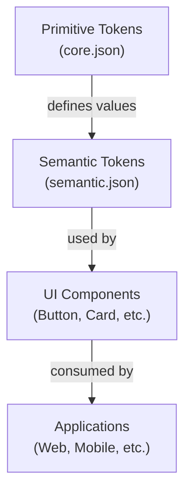
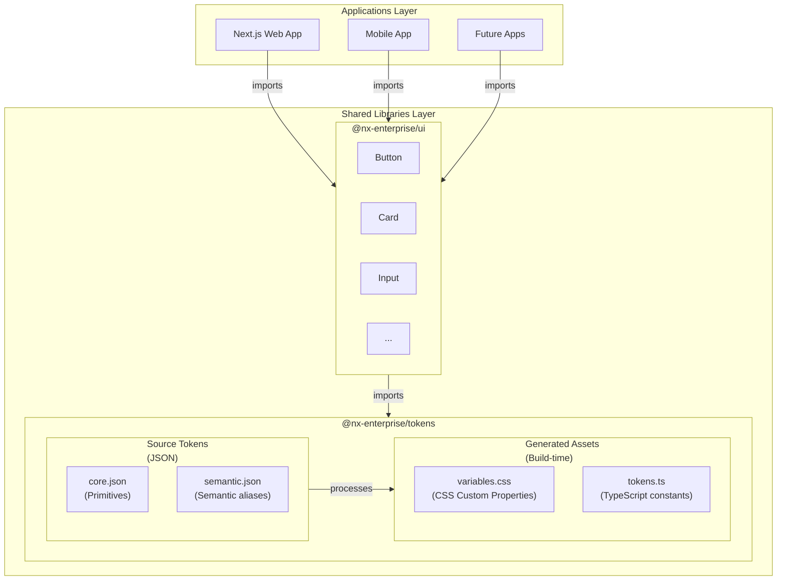
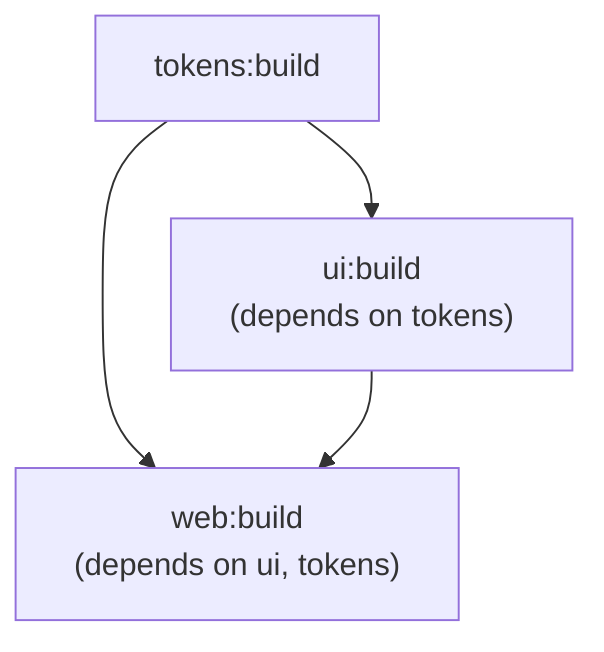

# 🏛️ Architecture Documentation

## Table of Contents

1. [Overview](#overview)
2. [Why This Architecture?](#why-this-architecture)
3. [Core Architectural Principles](#core-architectural-principles)
4. [System Architecture](#system-architecture)
5. [Token System Implementation](#token-system-implementation)
6. [UI Component Library](#ui-component-library)
7. [Application Layer](#application-layer)
8. [Build Pipeline](#build-pipeline)
9. [Development Workflow](#development-workflow)
10. [Figma-First Token Sync](#figma-first-token-sync) ⭐ **NEW**
11. [Architectural Decision Records](#architectural-decision-records)

---

## Overview

This Nx Enterprise monorepo implements a **token-first design system** architecture that enables scalable, maintainable, and consistent user interfaces across multiple applications. The architecture follows a layered approach where design decisions cascade from primitive tokens through semantic abstractions to reusable UI components, finally consumed by end-user applications.

### Key Components

- **Design Tokens Layer** (`libs/shared/tokens`): Source of truth for all design decisions
- **UI Component Library** (`libs/shared/ui`): Reusable React components styled with CSS Modules
- **Applications Layer** (`apps/web`): Next.js applications consuming shared libraries
- **Testing Infrastructure**: Unit tests (Jest) and E2E tests (Playwright)

---

## Why This Architecture?

### The Problem

Traditional web development faces several challenges:

1. **Design Inconsistency**: Different developers implementing the same design differently
2. **Maintenance Burden**: Changes to design tokens require updates across multiple files
3. **Scalability Issues**: Adding new applications or components leads to code duplication
4. **Design-Development Gap**: Designers and developers work with different source of truth
5. **Build Performance**: Monolithic architectures become slow as they grow

### The Solution

Our architecture addresses these challenges through:

#### 1. **Single Source of Truth (Tokens)**
- All design decisions (colors, spacing, typography) defined once in JSON
- Tokens generate both CSS variables and TypeScript constants
- Changes cascade automatically to all consumers
- Designers and developers reference the same token definitions

#### 2. **Layered Abstraction**


#### 3. **Monorepo Benefits**
- **Code Sharing**: Libraries shared across multiple applications
- **Atomic Changes**: Update component + all consumers in single PR
- **Type Safety**: TypeScript ensures consistency across boundaries
- **Efficient Builds**: Nx caching and task orchestration
- **Coordinated Releases**: All packages versioned together

#### 4. **Separation of Concerns**
- **Tokens**: What (design decisions)
- **Components**: How (implementation)
- **Applications**: Where (usage context)

---

## Core Architectural Principles

### 1. Token-First Design

**Principle**: All visual properties must reference design tokens, never hard-coded values.

**Why**: Enables consistent theming, easy design updates, and prevents design drift.

**Example**:
```css
/* ❌ Wrong - Hard-coded values */
.button {
  background-color: #2563eb;
  padding: 16px;
}

/* ✅ Correct - Token references */
.button {
  background-color: var(--brand-primary);
  padding: var(--spacing-md);
}
```

### 2. Progressive Enhancement

**Principle**: Build from primitives → semantic tokens → components → applications.

**Why**: Lower layers are stable and rarely change; higher layers adapt to specific needs.

**Flow**:
1. Define primitive values (hex colors, pixel values)
2. Create semantic aliases (brand-primary, spacing-md)
3. Build components using semantic tokens
4. Compose applications from components

### 3. Nx Workspace Architecture

**Principle**: Organize code by domain and scope, enforce boundaries.

**Why**: Prevents circular dependencies, enables independent development, improves build times.

**Structure**:
```
apps/           # Deployable applications
  web/          # Next.js web application
  web-e2e/      # E2E tests for web
libs/           # Shared libraries
  shared/       # Cross-cutting concerns
    tokens/     # Design system tokens
    ui/         # Component library
```

### 4. Build-Time Generation

**Principle**: Transform source tokens into consumable formats during build.

**Why**: Provides flexibility in output formats (CSS, TypeScript, JSON) and enables validation.

**Process**:
1. Define tokens in JSON (developer-friendly)
2. Style Dictionary processes tokens
3. Generate CSS variables (browser-friendly)
4. Generate TypeScript constants (type-safe)

---

## System Architecture

### High-Level Architecture Diagram



### Data Flow

1. **Token Definition** (Developer)
   - Modify `core.json` or `semantic.json`
   - Define primitive values or semantic aliases

2. **Build Process** (Style Dictionary)
   - Parse JSON token files
   - Apply transformations (kebab-case for CSS, camelCase for TS)
   - Generate output files

3. **Component Development** (Developer)
   - Import CSS variables in component styles
   - Reference tokens via `var(--token-name)`
   - Build type-safe components

4. **Application Integration** (Developer)
   - Import components from `@nx-enterprise/ui`
   - Import `variables.css` in root layout
   - Compose application pages

---

## Token System Implementation

### Architecture

The token system is built on **Style Dictionary**, a build-time tool that transforms design tokens from JSON into multiple platform-specific formats.

### Token Layers

#### Layer 1: Core Tokens (Primitives)

**File**: `libs/shared/tokens/src/tokens/core.json`

**Purpose**: Define raw, context-agnostic values.

**Example**:
```json
{
  "color": {
    "blue": {
      "600": { "value": "#2563eb" }
    }
  },
  "spacing": {
    "md": { "value": "16px" }
  }
}
```

**Characteristics**:
- Never reference other tokens
- Rarely change
- Platform-agnostic
- Named by physical properties

#### Layer 2: Semantic Tokens (Aliases)

**File**: `libs/shared/tokens/src/tokens/semantic.json`

**Purpose**: Create meaningful, context-aware aliases to core tokens.

**Example**:
```json
{
  "brand": {
    "primary": { "value": "{color.blue.600}" }
  },
  "text": {
    "base": { "value": "{color.gray.700}" }
  }
}
```

**Characteristics**:
- Reference core tokens using `{token.path}`
- Named by purpose/intent
- Changes affect specific contexts
- Enable theming and customization

### Build Pipeline

**Command**: `npx nx build tokens`

**Process**:
1. Script `scripts/build-tokens.ts` runs
2. Style Dictionary loads source JSON files
3. Tokens are processed through transforms:
   - `name/kebab` for CSS (e.g., `brand-primary`)
   - `name/camel` for TypeScript (e.g., `brandPrimary`)
4. Output files generated:
   - `generated/css/variables.css`: CSS custom properties
   - `generated/ts/tokens.ts`: TypeScript constants
   - `generated/ts/tokens.d.ts`: TypeScript type definitions

**Output Example** (`variables.css`):
```css
:root {
  --color-blue-600: #2563eb;
  --spacing-md: 16px;
  --brand-primary: #2563eb;
  --text-base: #374151;
}
```

### Token Consumption

#### In CSS Modules
```css
.button {
  background-color: var(--brand-primary);
  padding: var(--spacing-md);
  color: var(--text-on-brand);
}
```

#### In TypeScript
```typescript
import { brandPrimary, spacingMd } from '@nx-enterprise/tokens';

const inlineStyles = {
  backgroundColor: brandPrimary,
  padding: spacingMd,
};
```

### Why This Implementation?

1. **Single Source of Truth**: JSON files are the authority
2. **Multi-Platform**: Same tokens generate CSS, TS, iOS, Android formats
3. **Build-Time Safety**: Errors caught during build, not runtime
4. **Type Safety**: TypeScript constants provide autocomplete and validation
5. **Version Control**: Token changes are trackable in Git
6. **Scalability**: Adding new tokens or platforms is straightforward

---

## UI Component Library

### Architecture

The UI library (`libs/shared/ui`) follows a **component-per-directory** structure with co-located styles, tests, and stories.

### Component Structure

```
libs/shared/ui/src/lib/button/
  ├── Button.tsx           # Component implementation
  ├── Button.module.css    # Scoped styles
  ├── Button.spec.tsx      # Unit tests
  └── Button.stories.tsx   # Storybook documentation
```

### Design Patterns

#### 1. CSS Modules for Scoping

**Why**: Prevents style collisions, enables tree-shaking, co-locates styles with components.

**Example**:
```typescript
// Button.tsx
import styles from './Button.module.css';

export function Button({ variant = 'primary', children }) {
  return (
    <button className={`${styles.button} ${styles[variant]}`}>
      {children}
    </button>
  );
}
```

```css
/* Button.module.css */
.button {
  background-color: var(--brand-primary);
  padding: var(--spacing-md);
}

.button.secondary {
  background-color: var(--surface-muted);
}
```

#### 2. Variant-Based API

**Why**: Provides flexibility while maintaining consistency with design system.

**Pattern**:
```typescript
export interface ButtonProps {
  variant?: 'primary' | 'secondary' | 'outline';
  size?: 'small' | 'medium' | 'large';
}
```

#### 3. Composition Over Configuration

**Why**: Enables complex UIs without bloated component APIs.

**Example**:
```typescript
// Instead of <Button leftIcon={<Icon />} rightIcon={<Icon />} />
// Use composition:
<Button>
  <Icon /> {/* Left */}
  <span>Click Me</span>
  <Icon /> {/* Right */}
</Button>
```

### Component Development Workflow

1. **Generate**: `npx nx g @nx/react:component MyComponent --project=shared-ui`
2. **Implement**: Build component using tokens in CSS Module
3. **Test**: Write unit tests in `.spec.tsx`
4. **Document**: Create Storybook stories in `.stories.tsx`
5. **Export**: Add to `libs/shared/ui/src/index.ts`
6. **Verify**: Run `npx nx storybook ui` to preview

### Storybook Integration

**Why Storybook?**
- Visual testing and documentation
- Interactive component playground
- Isolated development environment
- Design system catalog

**Configuration**: `.storybook/main.ts` and `.storybook/preview.ts` set up Storybook with:
- CSS Modules support
- Token CSS imported globally
- Vite-based build for fast HMR

---

## Application Layer

### Next.js Architecture

The web application (`apps/web`) uses **Next.js 16 App Router** architecture.

### Key Decisions

#### 1. App Router (vs Pages Router)

**Why**:
- React Server Components for better performance
- Native layouts and nested routing
- Streaming and Suspense support
- Future-proof (Next.js direction)

#### 2. CSS Modules for Page Styles

**Why**:
- Consistent with component library
- No additional dependencies (Tailwind, styled-components)
- Full CSS features and browser compatibility
- Lightweight and performant

#### 3. Token Integration

**How**: Import `variables.css` in root layout:
```typescript
// apps/web/src/app/layout.tsx
import '../../../../libs/shared/tokens/generated/css/variables.css';
```

**Result**: All CSS custom properties available globally in app.

### Application Structure

```
apps/web/src/app/
  ├── layout.tsx        # Root layout (imports tokens)
  ├── page.tsx          # Home page
  ├── global.css        # Global styles
  ├── page.module.css   # Page-specific styles
  └── api/              # API routes
```

### Component Consumption

```typescript
// Import shared components
import { Button } from '@nx-enterprise/ui';

export default function Page() {
  return (
    <div>
      <Button variant="primary">Click Me</Button>
    </div>
  );
}
```

---

## Build Pipeline

### Nx Task Orchestration

Nx intelligently manages task execution with:

1. **Task Dependencies**: Tokens build before UI library builds
2. **Caching**: Results cached based on input hashes
3. **Parallel Execution**: Independent tasks run simultaneously
4. **Affected Detection**: Only rebuilds changed projects

### Build Graph



### Key Commands

| Task | Command | Purpose |
|------|---------|---------|
| Build tokens | `npx nx build tokens` | Generate CSS/TS from JSON |
| Build UI | `npx nx build ui` | Compile component library |
| Build web | `npx nx build web` | Build Next.js production bundle |
| Test all | `npx nx test <project>` | Run Jest unit tests |
| E2E tests | `npx nx e2e web-e2e` | Run Playwright E2E tests |
| Storybook | `npx nx storybook ui` | Launch component gallery |

### CI/CD Integration

The architecture supports automated workflows:

1. **Continuous Integration**:
   - Lint all changed projects
   - Test all affected projects
   - Build all affected projects

2. **Continuous Deployment**:
   - Build production bundles
   - Run E2E tests
   - Deploy to hosting platform

### Build Optimization

Nx optimizes builds through:
- **Computation Caching**: Cache task results locally and remotely
- **Affected Analysis**: `nx affected:build` only builds changed projects
- **Distributed Task Execution**: Parallelize across machines (Nx Cloud)

---

## Development Workflow

### Adding a New Token

**When**: Need a new color, spacing, or design value.

**Steps**:
1. Edit `libs/shared/tokens/src/tokens/core.json` (primitive) or `semantic.json` (alias)
2. Add new token:
   ```json
   {
     "color": {
       "purple": {
         "500": { "value": "#8b5cf6" }
       }
     }
   }
   ```
3. Run `npx nx build tokens`
4. Verify in `generated/css/variables.css`
5. Use in components: `var(--color-purple-500)`

### Adding a New Component

**When**: Need a reusable UI element.

**Steps**:
1. Generate component:
   ```bash
   npx nx g @nx/react:component Card --project=shared-ui
   ```

2. Implement with tokens:
   ```css
   /* Card.module.css */
   .card {
     background: var(--surface-base);
     border: 1px solid var(--border-default);
     border-radius: var(--border-radius-md);
     padding: var(--spacing-lg);
   }
   ```

3. Add tests (`Card.spec.tsx`)
4. Document in Storybook (`Card.stories.tsx`)
5. Export from `index.ts`
6. Verify in Storybook: `npx nx storybook ui`

### Adding a New Page

**When**: Creating new functionality in the web app.

**Steps**:
1. Create route in `apps/web/src/app/`
   - File: `about/page.tsx`
   
2. Import components:
   ```typescript
   import { Button, Card } from '@nx-enterprise/ui';
   ```

3. Add page styles (`page.module.css`)
4. Reference tokens as needed
5. Test locally: `npx nx dev web`

### Updating an Existing Token

**Impact**: Affects all components and apps using the token.

**Steps**:
1. Modify token value in source JSON
2. Rebuild tokens: `npx nx build tokens`
3. Test affected components in Storybook
4. Test affected pages in web app
5. Commit as atomic change

---

## Figma-First Token Sync

### Overview

Tokens are now managed exclusively in **Figma as the source of truth**. Token changes flow from Figma → GitHub PR → Design team review → Production via an automated, on-demand sync workflow.

### Architecture



```mermaid
graph LR
    figma["🎨 Figma<br/>(Source of Truth)"]
    trigger["🚀 Trigger Sync<br/>(On-Demand)"]
    fetch["📡 Fetch Tokens<br/>(Figma API)"]
    validate["✅ Validate<br/>(Naming Conventions)"]
    pr["📝 Create PR<br/>(tokens/figma-sync)"]
    review["👥 Design Team Review<br/>(via CODEOWNERS)"]
    merge["✔️ Merge to main"]
    build["🔨 Auto-Build<br/>(Style Dictionary)"]
    deploy["🚀 Deploy"]
    
    figma --> trigger
    trigger --> fetch
    fetch --> validate
    validate --> pr
    pr --> review
    review --> merge
    merge --> build
    build --> deploy
```

### Token Naming Conventions

All tokens in Figma **must follow kebab-case naming with at least one group**:

**Approved Format**: `group-subgroup-name`

**Examples**:
- ✅ `color-primary`
- ✅ `color-brand-blue-600`
- ✅ `spacing-md`
- ✅ `typography-heading-lg`
- ❌ `primary` (missing group)
- ❌ `ColorPrimary` (not kebab-case)
- ❌ `color_primary` (using underscores)

**Naming Violation Handling**:
- Violations are logged as **non-blocking warnings** in the PR
- Design team reviews warnings and decides to:
  - Fix tokens in Figma and re-trigger sync, or
  - Approve PR to accept violations
- Sync workflow never blocks on naming violations

### Triggering a Sync

#### Method 1: GitHub UI

1. Navigate to **Actions** → **"Figma Token Sync (On-Demand)"**
2. Click **"Run workflow"**
3. Leave optional inputs blank (auto-generates branch)
4. Workflow executes immediately

#### Method 2: GitHub CLI

```bash
gh workflow run figma-token-sync.yml --repo your-org/nx-enterprise
```

### What Happens During Sync

1. **Fetch from Figma API**: Retrieves all tokens from Figma file
2. **Validate Naming**: Checks conventions, logs violations as warnings
3. **Check for Existing PRs**: Closes any open `tokens/figma-sync` PR
4. **Generate Token Files**: Creates updated `core.json` and `semantic.json`
5. **Create PR**: Opens pull request on `tokens/figma-sync` branch with:
   - Detailed changes and violations (if any)
   - Git commit hash for audit trail
   - Automatic assignment to design team via CODEOWNERS
6. **Design Team Review**: Team reviews, tests, and approves
7. **Merge & Deploy**: Merges to `main`, triggers token build, deploys

### PR Contents

Each Figma sync PR includes:

**Title**: `🎨 Figma Token Sync - 2026-02-20 15:30`

**Body** contains:
- Source: Figma
- Timestamp of sync
- **Audit Trail**: Git commit hash of when sync was triggered
- Changes summary
- Naming violations (if any) with action items
- Merge deadline reminder

**Example PR Body**:
```
# 🎨 Figma Token Sync

**Source**: Figma  
**Triggered**: On-demand sync  
**Timestamp**: 2026-02-20T15:30:00Z

## Audit Trail

**Git Commit Hash**: `a3f8b92c1d4e5f6g7h8i9j0k1l2m3n4o`

## Changes

- Updated design tokens from Figma
- Generated new CSS variables and TypeScript constants
- Violations found: **2**

## Instructions

1. Review the changes in the Files tab
2. Check for violations below (if any)
3. Approve and merge when ready

> ⚠️ **Merge before next sync**: The next Figma sync will close this PR. Ensure all changes are merged before triggering another sync.

## Naming Convention Violations

The following tokens don't follow the naming convention (kebab-case with groups):

```json
[
  { "token": "primary", "issue": "Missing token group. Expected: group-name, got: primary" },
  { "token": "ButtonSize", "issue": "Not in kebab-case format. Expected: lowercase-with-dashes, got: ButtonSize" }
]
```

💡 **Next steps**:
- Fix these tokens in Figma, or
- Approve this PR to accept as-is
```

### Auto-Close Policy (Stale PRs)

To prevent conflicts, token sync PRs are **automatically closed if unmerged for 7+ days**.

**Why**:
- Ensures clear merge-before-next-sync workflow
- Prevents long-lived branches with potential conflicts
- Encourages timely design team review

**What Happens**:
1. Daily automated check finds open `tokens/figma-sync` PRs older than 7 days
2. PR is closed with explanatory comment
3. Design team can re-trigger sync if needed

**Example Auto-Close Comment**:
```
🧹 **Auto-closed stale PR**

This PR was open for more than 7 days without being merged. To maintain a clean workflow and prevent conflicts, stale token sync PRs are automatically closed.

## What does this mean?

Per the token sync policy:
- ✅ **Merge before next sync**: Token changes must be merged before the next Figma sync is triggered
- 🔄 **Auto-close policy**: PRs older than 7 days are closed to prevent conflicts

## Next steps

If you still need these token changes:
1. Trigger a new Figma sync from the Actions tab
2. A fresh PR will be created with the latest Figma tokens

**Created**: 2026-02-13 14:22  
**Closed by**: Automated stale PR cleanup
```

### Audit Trail & Rollback

Each sync PR includes a **git commit hash** for complete audit trail:

**In PR Body**:
```
**Git Commit Hash**: `a3f8b92c1d4e5f6g7h8i9j0k1l2m3n4o`
```

**In Commit Message**:
```
chore(tokens): sync from Figma

Synced at: 2026-02-20T15:30:00Z
Git commit hash: a3f8b92c1d4e5f6g7h8i9j0k1l2m3n4o
```

**To Rollback**:
1. Revert the merge commit in git
2. Or trigger a new sync after fixing tokens in Figma

### Migration from Manual JSON Editing

Previous workflow (manual):
```
Edit core.json → Run npx nx build tokens → Commit → Create PR
```

**New workflow (Figma-first)**:
```
Edit in Figma → Trigger sync from GitHub UI → Design team reviews PR → Merge → Auto-build & deploy
```

**Key differences**:
- ❌ **Never manually edit** `libs/shared/tokens/src/tokens/*.json` - these are now auto-generated
- ✅ **All changes start in Figma**
- ✅ **Automatic PR creation** with design team auto-assigned
- ✅ **Non-blocking validation** of naming conventions
- ✅ **Full audit trail** with git commit hashes

### Team Responsibilities

#### Design Team
- Maintain tokens in Figma
- Follow naming conventions (kebab-case with groups)
- Review token sync PRs for correctness
- Approve changes before merge

#### Development Team
- Use generated tokens in components
- Never manually edit token JSON files
- Report token sync issues
- Monitor token builds in CI/CD

### Troubleshooting

**Q: I triggered sync but no PR appeared**
- A: Check if changes were actually made in Figma. Sync only creates PR if there are changes.

**Q: My tokens have naming violations**
- A: Fix in Figma and re-trigger sync, or approve PR with violations (design team decides).

**Q: PR was auto-closed due to stale policy**
- A: Trigger a fresh sync from Actions tab. New PR will be created with latest Figma tokens.

**Q: I need to rollback a merged token change**
- A: Revert the token in Figma → Trigger sync → New PR created with rollback → Merge.

---

## Architectural Decision Records

### ADR-001: Style Dictionary for Token Management

**Decision**: Use Style Dictionary as the token transformation engine.

**Context**: Need to transform design tokens from JSON to multiple formats (CSS, TypeScript, potentially mobile platforms).

**Rationale**:
- Industry-standard solution (Amazon, Adobe)
- Extensible transform/format system
- Multi-platform support
- Active community and maintenance

**Consequences**:
- Build step required for token changes
- Learning curve for custom transforms
- Token format must match Style Dictionary schema

### ADR-002: CSS Modules for Styling

**Decision**: Use CSS Modules for component styling instead of CSS-in-JS or Tailwind.

**Context**: Need a styling solution that is performant, maintainable, and supports design tokens.

**Rationale**:
- **Zero Runtime Cost**: Styles extracted at build time
- **Native CSS**: Full CSS features, no learning curve
- **Token Integration**: Direct use of CSS custom properties
- **Scoping**: Automatic class name hashing prevents collisions
- **Performance**: No JavaScript overhead for styles

**Alternatives Considered**:
- **Tailwind**: Requires build step, utility-first learning curve, harder to use with tokens
- **styled-components**: Runtime overhead, complex with SSR, no native CSS features
- **Emotion**: Similar issues to styled-components

**Consequences**:
- Separate .css files to manage
- No dynamic styling without CSS variables
- Need to import styles in every component

### ADR-003: Nx Monorepo Structure

**Decision**: Use Nx for monorepo management and build orchestration.

**Context**: Need to manage multiple applications and shared libraries efficiently.

**Rationale**:
- **Task Orchestration**: Intelligent build ordering and caching
- **Code Sharing**: Easy to share code between apps
- **Consistency**: Enforce architectural boundaries
- **Performance**: Affected detection and parallel execution
- **Tooling**: Generators, migration scripts, and plugins

**Consequences**:
- Nx-specific configuration and learning curve
- All projects must follow Nx conventions
- Powerful but complex for small teams

### ADR-004: Token-First Design Philosophy

**Decision**: All design decisions must originate as tokens; no hard-coded values in components.

**Context**: Need to maintain design consistency and enable theming.

**Rationale**:
- **Single Source of Truth**: Designers and developers reference same values
- **Consistency**: Impossible to accidentally use wrong values
- **Maintainability**: Change once, applies everywhere
- **Theming**: Swap token values for different themes/brands
- **Documentation**: Tokens serve as design system documentation

**Consequences**:
- Overhead of creating tokens for every value
- Requires discipline to enforce
- May feel restrictive initially

### ADR-005: Next.js App Router

**Decision**: Use Next.js 16 App Router for the web application.

**Context**: Need a React framework for server-side rendering and modern web features.

**Rationale**:
- **React Server Components**: Better performance and smaller bundles
- **Layouts**: Nested layouts reduce duplication
- **Streaming**: Incremental page rendering
- **Future-proof**: Next.js focus and React direction
- **Developer Experience**: Great tooling and fast refresh

**Consequences**:
- Learning curve for RSC and App Router paradigms
- Some third-party libraries may not be compatible
- Migration path from older Next.js versions

### ADR-006: Figma as Single Source of Truth for Tokens

**Decision**: Use Figma (via REST API) as the authoritative source for design tokens, with on-demand automated sync to repository.

**Context**: Need to close the designer-developer gap for token management while maintaining version control and automated deployments.

**Rationale**:
- **Designer Workflow**: Designers work in Figma natively without context switching
- **Single Source**: One place for design decisions, eliminating duplication
- **Automated Sync**: GitHub Actions ensures tokens are always in sync, no manual steps
- **Governance**: On-demand sync with required review enforces design intent
- **Audit Trail**: Git commit hashes track when changes were synced
- **Conflict Prevention**: Auto-close stale PRs prevent long-lived merge conflicts

**Alternatives Considered**:
- **Manual JSON editing**: Developers edit token files manually (slower, error-prone)
- **Tokens Studio plugin**: Figma plugin for exports (less control over process)
- **Continuous sync**: Automatic sync on every Figma change (too aggressive, no approval gate)

**Implementation Details**:
- On-demand workflow triggered from GitHub Actions UI
- Figma API fetches tokens from design file
- Naming conventions validated (kebab-case with groups, non-blocking warnings)
- PR auto-assigned to design team via CODEOWNERS
- Stale PRs auto-close after 7 days to maintain clean workflow

**Consequences**:
- Requires Figma access token in GitHub secrets
- Design team must maintain naming conventions in Figma
- Manual JSON edits are ignored (source of truth moves to Figma)
- Developers cannot directly change tokens (must go through Figma + sync)
- Sync workflow depends on GitHub Actions and Figma API availability

---

## Conclusion

This architecture provides a **scalable, maintainable, and consistent** foundation for building enterprise applications. The token-first approach ensures design consistency, the monorepo structure enables code sharing, and the layered architecture allows teams to work independently while maintaining cohesion.

### Key Benefits

1. **Consistency**: Design tokens enforce visual consistency
2. **Scalability**: Easy to add new apps and components
3. **Maintainability**: Changes cascade through layers automatically
4. **Performance**: Nx caching and optimized builds
5. **Developer Experience**: Type safety, hot reload, and excellent tooling
6. **Future-Proof**: Modern stack aligned with industry direction

### Next Steps

- Expand component library with common patterns
- Add theme variants (dark mode, brand themes)
- Integrate with design tools (Figma tokens)
- Set up Nx Cloud for distributed caching
- Add visual regression testing
- Create migration guides for new developers

---

**Last Updated**: 2026-02-13  
**Maintained By**: Enterprise Team
