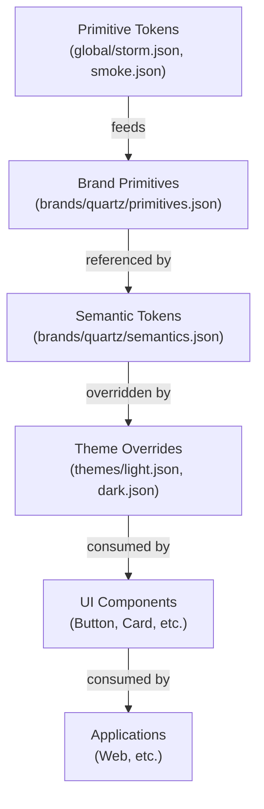
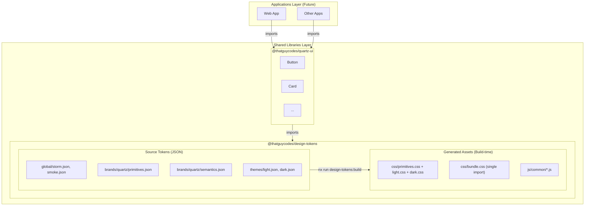
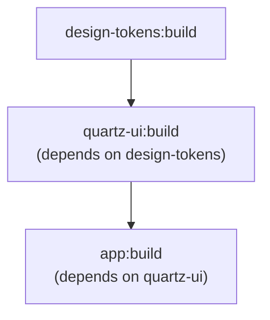
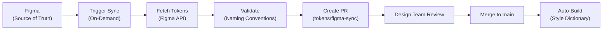

# Architecture Documentation

## Table of Contents

1. [Overview](#overview)
2. [Why This Architecture?](#why-this-architecture)
3. [Core Architectural Principles](#core-architectural-principles)
4. [System Architecture](#system-architecture)
5. [Token System Implementation](#token-system-implementation)
6. [UI Component Library](#ui-component-library)
7. [Application Layer](#application-layer)
8. [Build Pipeline](#build-pipeline)
9. [Development Workflow](#development-workflow)
10. [Figma-First Token Sync](#figma-first-token-sync)
11. [Architectural Decision Records](#architectural-decision-records)

---

## Overview

This Nx Enterprise monorepo implements a **token-first design system** architecture that enables scalable, maintainable, and consistent user interfaces across multiple applications. The architecture follows a layered approach where design decisions cascade from primitive tokens through semantic abstractions to reusable UI components, finally consumed by end-user applications.

### Key Components

- **Design Tokens Layer** (`libs/design-tokens`): Source of truth for all design decisions
- **UI Component Library** (`libs/quartz-ui`): Reusable React components styled with CSS Modules
- **Applications Layer** (`apps/`): Reserved for future applications (not yet implemented)
- **Testing Infrastructure**: Unit tests (Jest)

---

## Why This Architecture?

### The Problem

Traditional web development faces several challenges:

1. **Design Inconsistency**: Different developers implementing the same design differently
2. **Maintenance Burden**: Changes to design tokens require updates across multiple files
3. **Scalability Issues**: Adding new applications or components leads to code duplication
4. **Design-Development Gap**: Designers and developers work with different source of truth
5. **Build Performance**: Monolithic architectures become slow as they grow

### The Solution

Our architecture addresses these challenges through:

#### 1. **Single Source of Truth (Tokens)**

- All design decisions (colors, spacing, typography) defined once in JSON
- Tokens generate CSS variables consumed by all components
- Changes cascade automatically to all consumers
- Designers and developers reference the same token definitions

#### 2. **Layered Abstraction**



#### 3. **Monorepo Benefits**

- **Code Sharing**: Libraries shared across multiple applications
- **Atomic Changes**: Update component + all consumers in single PR
- **Type Safety**: TypeScript ensures consistency across boundaries
- **Efficient Builds**: Nx caching and task orchestration
- **Coordinated Releases**: All packages versioned together

#### 4. **Separation of Concerns**

- **Tokens**: What (design decisions)
- **Components**: How (implementation)
- **Applications**: Where (usage context)

---

## Core Architectural Principles

### 1. Token-First Design

**Principle**: All visual properties must reference semantic design tokens, never hard-coded values.

**Why**: Enables consistent theming, easy design updates, and prevents design drift.

**Example**:

```css
/* ❌ Wrong - hard-coded values */
.button {
  background-color: #7c3aed;
  color: #f8fafc;
}

/* ✅ Correct - semantic token references */
.button {
  background-color: var(--color-primary-default);
  color: var(--color-text-on-primary);
}
```

### 2. Progressive Enhancement

**Principle**: Build from primitives → semantic tokens → components → applications.

**Why**: Lower layers are stable and rarely change; higher layers adapt to specific needs.

**Flow**:

1. Define primitive values (hex colors in `global/*.json` and `brands/*/primitives.json`)
2. Create semantic aliases (`brands/*/semantics.json` and `themes/*.json`)
3. Build components using semantic `--color-*` tokens
4. Compose applications from components

### 3. Nx Workspace Architecture

**Principle**: Organize code by domain and scope, enforce boundaries.

**Why**: Prevents circular dependencies, enables independent development, improves build times.

**Structure**:

```
apps/           # Reserved for future deployable applications
libs/           # Shared libraries
  design-tokens/ # Design system tokens
  quartz-ui/     # Component library
```

### 4. Build-Time Generation

**Principle**: Transform source tokens into consumable CSS during build.

**Why**: Provides a single authoritative set of CSS custom properties, validated at build time.

**Process**:

1. Define tokens in JSON (DTCG format)
2. Style Dictionary processes tokens
3. Generate CSS custom properties per theme (`light`, `dark`) and a bundled import

---

## System Architecture

### High-Level Architecture Diagram



### Data Flow

1. **Token Definition** (source JSON files in `libs/design-tokens/src/tokens/`)
   - Edit primitive scales, brand palette, semantic mappings, or theme overrides
   - Run `nx run design-tokens:build` to regenerate CSS

2. **Build Process** (Style Dictionary)
   - Resolves token references (`{brand.60}`, `{storm.20}`, etc.)
   - Generates CSS custom properties per output file

3. **Component Development** (Developer)
   - Import CSS variables in component styles via `var(--color-*)`
   - Only semantic `--color-*` tokens used in component CSS

4. **Application Integration** (Future)
   - Import `@thatguycodes/design-tokens/css/bundle.css` in root layout
   - Consume `@thatguycodes/quartz-ui` components

---

## Token System Implementation

### Architecture

The token system is built on **Style Dictionary v5**, a build-time tool that transforms design tokens from JSON ([DTCG format](https://tr.designtokens.org/format/)) into CSS custom properties.

### Token Source Structure

```
libs/design-tokens/src/tokens/
├── global/
│   ├── storm.json          # Slate/cool-gray scale — 13 steps (5–95)
│   └── smoke.json          # Warm-gray scale — 11 steps (5–95)
├── brands/
│   └── quartz/
│       ├── primitives.json # Brand violet palette — 11 steps under root key "brand"
│       └── semantics.json  # Semantic mappings referencing {brand.*}, {storm.*}, {smoke.*}
└── themes/
    ├── light.json          # Light mode overrides
    └── dark.json           # Dark mode overrides
```

> **Primitives are immutable.** Never change hex values in `global/*.json` or `brands/*/primitives.json`. See `libs/design-tokens/guard-rails/PRIMITIVE_CONSTRAINTS.md`.

#### Layer 1: Primitive Scales

**Files**: `global/storm.json`, `global/smoke.json`

**Purpose**: Define raw color scales that feed into brand and semantic layers.

**Example** (`global/storm.json`):

```json
{
  "storm": {
    "20": { "$type": "color", "$value": "#e2e8f0" },
    "50": { "$type": "color", "$value": "#64748b" },
    "90": { "$type": "color", "$value": "#0f172a" }
  }
}
```

**Characteristics**:

- Named by palette and numeric step
- Never reference other tokens
- Rarely change — immutable once established

#### Layer 2: Brand Primitives

**File**: `brands/quartz/primitives.json`

**Purpose**: Define the brand color ramp under the root key `"brand"` so semantic files can reference `{brand.*}` abstractly.

**Example**:

```json
{
  "brand": {
    "60": { "$type": "color", "$value": "#7c3aed" },
    "70": { "$type": "color", "$value": "#6d28d9" }
  }
}
```

#### Layer 3: Semantic Tokens

**Files**: `brands/quartz/semantics.json`, `themes/light.json`, `themes/dark.json`

**Purpose**: Create meaningful, context-aware aliases that components consume. Theme files override semantic values for light and dark mode.

**Example** (`semantics.json`):

```json
{
  "color": {
    "primary": {
      "default": { "$type": "color", "$value": "{brand.60}" },
      "hover":   { "$type": "color", "$value": "{brand.70}" }
    },
    "text": {
      "base": { "$type": "color", "$value": "{storm.95}" }
    }
  }
}
```

**Characteristics**:

- Reference primitive tokens using `{token.path}` syntax
- Named by purpose/intent (`primary-default`, `text-base`, `background-subtle`)
- Theme files override these for light/dark mode

### Build

```bash
nx run design-tokens:build   # regenerates src/generated/ and compiles
```

**Generated outputs** (`libs/design-tokens/src/generated/`):

| File | Selector | Contents |
|---|---|---|
| `css/primitives.css` | `:root` | Raw primitive custom properties |
| `css/light.css` | `[data-theme="light"]` | Semantic + primitive variables for light mode |
| `css/dark.css` | `[data-theme="dark"]` | Semantic + primitive variables for dark mode |
| `css/bundle.css` | — | `@import` of all three above — use this in most cases |
| `js/common/primitives.js` | — | JS module of primitive values |
| `js/common/light.js` | — | JS module of light theme values |
| `js/common/dark.js` | — | JS module of dark theme values |

**CSS output example** (`css/light.css`):

```css
[data-theme="light"] {
  --color-primary-default: #7c3aed;
  --color-primary-hover: #6d28d9;
  --color-primary-active: #5b21b6;
  --color-text-base: #020617;
  --color-text-muted: #475569;
  --color-background-base: #f8fafc;
  --color-background-subtle: #f1f5f9;
  --color-border-default: #e2e8f0;
  --color-surface-base: #f8fafc;
}
```

### CSS Variable Naming

| Layer | Pattern | Example |
|---|---|---|
| Primitive | `--brand-{step}` | `--brand-60` = `#7c3aed` |
| Primitive | `--storm-{step}` | `--storm-20` = `#e2e8f0` |
| Primitive | `--smoke-{step}` | `--smoke-30` = `#8b8b8b` |
| Semantic | `--color-primary-{state}` | `--color-primary-default` |
| Semantic | `--color-text-{role}` | `--color-text-base` |
| Semantic | `--color-background-{level}` | `--color-background-subtle` |
| Semantic | `--color-border-{role}` | `--color-border-focus` |
| Semantic | `--color-surface-{level}` | `--color-surface-muted` |

### Token Consumption

#### In CSS Modules (components)

Only `--color-*` semantic tokens are used in component CSS. Primitive tokens (`--brand-*`, `--storm-*`) are only referenced in documented dark mode override blocks.

```css
.button {
  background-color: var(--color-primary-default);
  color: var(--color-text-on-primary);
  border-color: var(--color-border-default);
}

/* Dark mode override — uses primitive for adequate contrast on dark canvas */
:global([data-theme='dark']) .button.outline {
  border-color: var(--brand-40);
  color: var(--brand-40);
}
```

#### In Applications

```typescript
// Single import — primitives + light + dark (recommended)
import '@thatguycodes/design-tokens/css/bundle.css';

// Or selective imports
import '@thatguycodes/design-tokens/css/primitives.css';
import '@thatguycodes/design-tokens/css/light.css';
import '@thatguycodes/design-tokens/css/dark.css';
```

### Why This Implementation?

1. **Single Source of Truth**: JSON token files → CSS for all consumers
2. **Build-Time Safety**: Errors caught during `nx run design-tokens:build`, not runtime
3. **Theme Switching**: `data-theme` attribute on `<html>` switches between light/dark CSS scopes
4. **Version Control**: Token changes are trackable in Git history

---

## UI Component Library

### Architecture

The UI library (`libs/quartz-ui`) follows a **component-per-directory** structure with co-located styles, tests, and stories.

### Component Structure

```
libs/quartz-ui/src/lib/
├── button/
│   ├── Button.tsx           # Component implementation
│   ├── Button.module.css    # Scoped styles
│   ├── Button.spec.tsx      # Unit tests
│   └── Button.stories.tsx   # Storybook stories (title: 'Components/Button')
├── card/
│   ├── Card.tsx
│   ├── Card.module.css
│   ├── Card.spec.tsx
│   └── Card.stories.tsx     # title: 'Components/Card'
└── theme/
    └── ThemeContext.tsx      # ThemeProvider + useTheme hook
```

### Design Patterns

#### 1. CSS Modules for Scoping

**Why**: Prevents style collisions, enables tree-shaking, co-locates styles with components.

**Example**:

```typescript
// Button.tsx
import styles from './Button.module.css';

export function Button({ variant = 'primary', size = 'medium', children, ...props }) {
  const className = [styles.button, styles[variant], styles[size]]
    .filter(Boolean)
    .join(' ');
  return (
    <button type="button" className={className} {...props}>
      {children}
    </button>
  );
}
```

```css
/* Button.module.css — only --color-* semantic tokens */
.button {
  background-color: var(--color-primary-default);
  color: var(--color-text-on-primary);
}
```

#### 2. Variant-Based API

**Why**: Provides flexibility while maintaining consistency with design system.

**Pattern**:

```typescript
export interface ButtonProps {
  variant?: 'primary' | 'secondary' | 'outline';
  size?: 'small' | 'medium' | 'large';
}
```

#### 3. Composition Over Configuration

**Why**: Enables complex UIs without bloated component APIs.

**Example**:

```typescript
// Instead of <Button leftIcon={<Icon />} rightIcon={<Icon />} />
// Use composition:
<Button>
  <Icon /> {/* Left */}
  <span>Click Me</span>
  <Icon /> {/* Right */}
</Button>
```

### Component Development Workflow

1. **Create directory**: `libs/quartz-ui/src/lib/<name>/`
2. **Implement**: Build component using `--color-*` tokens in CSS Module
3. **Test**: Write unit tests in `.spec.tsx`
4. **Document**: Create Storybook stories in `.stories.tsx` with `title: 'Components/<Name>'`
5. **Export**: Add to `libs/quartz-ui/src/index.ts`
6. **Verify**: Run `npx nx run quartz-ui:storybook` to preview

### Storybook Integration

**Why Storybook?**

- Visual testing and documentation
- Interactive component playground
- Isolated development environment
- Design system catalog

**Configuration**: `.storybook/main.ts` and `.storybook/preview.ts` set up Storybook with:

- CSS Modules support via Vite
- `@thatguycodes/design-tokens/css/bundle.css` imported globally
- Theme switching (Light / Dark) via `data-theme` attribute (`@storybook/addon-themes`)
- Vite alias resolves `@thatguycodes/design-tokens/css/` to local `design-tokens/src/generated/css/` (bypasses npm symlinks)
- Vite-based build for fast HMR

---

## Application Layer

> The `apps/` directory is currently empty — reserved for future applications. This section describes the intended architecture when applications are added.

### Next.js Architecture

Future applications will use **Next.js App Router** architecture, consuming `@thatguycodes/quartz-ui` and `@thatguycodes/design-tokens`.

### Key Decisions

#### 1. App Router (vs Pages Router)

**Why**:

- React Server Components for better performance
- Native layouts and nested routing
- Streaming and Suspense support
- Future-proof (Next.js direction)

#### 2. CSS Modules for Page Styles

**Why**:

- Consistent with component library
- No additional dependencies (Tailwind, styled-components)
- Full CSS features and browser compatibility
- Lightweight and performant

#### 3. Token Integration

**How**: Import the bundle CSS in root layout:

```typescript
// apps/<name>/src/app/layout.tsx
import '@thatguycodes/design-tokens/css/bundle.css';
```

**Result**: All CSS custom properties available globally; theme switched via `data-theme` on `<html>` using `ThemeProvider` from `@thatguycodes/quartz-ui`.

### Application Structure (Planned)

```
apps/<name>/src/app/
  ├── layout.tsx        # Root layout (imports bundle.css, wraps in ThemeProvider)
  ├── page.tsx          # Home page
  ├── global.css        # Global styles
  └── page.module.css   # Page-specific styles
```

### Component Consumption

```typescript
import { Button, Card, ThemeProvider } from '@thatguycodes/quartz-ui';

export default function Page() {
  return (
    <div>
      <Button variant="primary">Click Me</Button>
      <Card title="Hello">Content</Card>
    </div>
  );
}
```

---

## Build Pipeline

### Nx Task Orchestration

Nx intelligently manages task execution with:

1. **Task Dependencies**: Tokens build before UI library builds
2. **Caching**: Results cached based on input hashes
3. **Parallel Execution**: Independent tasks run simultaneously
4. **Affected Detection**: Only rebuilds changed projects

### Build Graph



### Key Commands

| Task | Command | Purpose |
|---|---|---|
| Build tokens | `npx nx run design-tokens:build` | Regenerate CSS from source JSON |
| Build UI | `npx nx run quartz-ui:build` | Compile component library |
| Test all | `npx nx run-many -t test` | Run all Jest unit tests |
| Storybook | `npx nx run quartz-ui:storybook` | Launch component gallery |
| Version | `npx nx release version --projects quartz-ui` | Bump version |
| Publish | `npx nx release publish --projects quartz-ui` | Publish to npm |

### CI/CD Integration

The architecture supports automated workflows:

1. **Continuous Integration**:
   - Lint all changed projects
   - Test all affected projects
   - Build all affected projects

2. **Continuous Deployment**:
   - Build production bundles
   - Deploy Storybook to Vercel (`libs/quartz-ui/storybook-static`)

### Build Optimization

Nx optimizes builds through:

- **Computation Caching**: Cache task results locally and remotely
- **Affected Analysis**: `nx affected -t build` only builds changed projects
- **Distributed Task Execution**: Parallelize across machines (Nx Cloud)

---

## Development Workflow

### Adding a New Token

**When**: Need a new semantic color role.

**Steps**:

1. Edit the relevant source JSON in `libs/design-tokens/src/tokens/`
   - Global scale: `global/storm.json` or `global/smoke.json`
   - Brand primitive: `brands/quartz/primitives.json`
   - Semantic alias: `brands/quartz/semantics.json`
   - Theme override: `themes/light.json` or `themes/dark.json`
2. Run `nx run design-tokens:build` to regenerate CSS
3. Use the new token in components: `var(--your-new-token)`
4. Verify contrast ratios if adding a colour pairing (WCAG 2.1 AA minimum)

> **Never change primitive hex values** in `global/*.json` or `brands/*/primitives.json`. See `guard-rails/PRIMITIVE_CONSTRAINTS.md`.

### Adding a New Component

**When**: Need a reusable UI element.

**Steps**:

1. Create directory: `libs/quartz-ui/src/lib/<name>/`

2. Implement with semantic tokens only:

   ```css
   /* Card.module.css */
   .card {
     background-color: var(--color-surface-base);
     border: 1px solid var(--color-border-default);
     border-radius: 10px; /* no border-radius token exists */
     padding: 1.5rem;     /* no spacing token exists */
   }
   ```

3. Add tests (`<Name>.spec.tsx`)
4. Document in Storybook (`<Name>.stories.tsx`) with `title: 'Components/<Name>'`
5. Export from `libs/quartz-ui/src/index.ts`
6. Verify: `npx nx run quartz-ui:storybook`
7. Run tests: `npx nx run quartz-ui:test`

### Adding a New Page

> **No applications currently exist.** This workflow applies once an app is added under `apps/`.

**When**: Creating new functionality in an application.

**Steps**:

1. Create route in `apps/<name>/src/app/`
2. Import components:
   ```typescript
   import { Button, Card } from '@thatguycodes/quartz-ui';
   ```
3. Add page styles (`page.module.css`)
4. Reference tokens as needed
5. Test locally: `npx nx run <app-name>:dev`

### Updating an Existing Token

**Impact**: Affects all components and apps using the token.

**Steps**:

1. Edit the relevant JSON file in `libs/design-tokens/src/tokens/`
2. Run `nx run design-tokens:build`
3. Test affected components in Storybook

---

## Figma-First Token Sync

> **This section describes the planned future token sync workflow.** Tokens are currently maintained as source-controlled JSON files edited directly. The Figma-first workflow below is the intended end state once the sync automation is in place.

### Overview

The planned workflow moves token ownership to **Figma as the source of truth**. Token changes will flow from Figma → GitHub PR → Design team review → Production via an automated, on-demand sync workflow.

### Architecture



### Token Naming Conventions

All tokens in Figma **must follow kebab-case naming with at least one group**:

**Approved Format**: `group-subgroup-name`

**Examples**:

- ✅ `color-primary`
- ✅ `color-brand-blue-600`
- ✅ `spacing-md`
- ✅ `typography-heading-lg`
- ❌ `primary` (missing group)
- ❌ `ColorPrimary` (not kebab-case)
- ❌ `color_primary` (using underscores)

### Triggering a Sync

#### Method 1: GitHub UI

1. Navigate to **Actions** → **"Figma Token Sync (On-Demand)"**
2. Click **"Run workflow"**
3. Leave optional inputs blank (auto-generates branch)
4. Workflow executes immediately

#### Method 2: GitHub CLI

```bash
gh workflow run figma-token-sync.yml --repo your-org/quartz-xp
```

### Auto-Close Policy (Stale PRs)

Token sync PRs are **automatically closed if unmerged for 7+ days** to prevent conflicts.

### Team Responsibilities

#### Design Team
- Maintain tokens in Figma
- Follow naming conventions (kebab-case with groups)
- Review token sync PRs for correctness
- Approve changes before merge

#### Development Team
- Use generated tokens in components
- Never manually edit token JSON files once Figma sync is active
- Report token sync issues
- Monitor token builds in CI/CD

---

## Architectural Decision Records

### ADR-001: Style Dictionary for Token Management

**Decision**: Use Style Dictionary as the token transformation engine.

**Context**: Need to transform design tokens from JSON to CSS (and potentially other platform formats).

**Rationale**:
- Industry-standard solution (Amazon, Adobe)
- Extensible transform/format system
- DTCG format support
- Active community and maintenance

**Consequences**:
- Build step required for token changes
- Learning curve for custom transforms
- Token format must match Style Dictionary schema

### ADR-002: CSS Modules for Styling

**Decision**: Use CSS Modules for component styling instead of CSS-in-JS or Tailwind.

**Context**: Need a styling solution that is performant, maintainable, and supports design tokens.

**Rationale**:
- **Zero Runtime Cost**: Styles extracted at build time
- **Native CSS**: Full CSS features, no learning curve
- **Token Integration**: Direct use of CSS custom properties
- **Scoping**: Automatic class name hashing prevents collisions
- **Performance**: No JavaScript overhead for styles

**Alternatives Considered**:
- **Tailwind**: Requires build step, utility-first learning curve, harder to use with tokens
- **styled-components**: Runtime overhead, complex with SSR, no native CSS features
- **Emotion**: Similar issues to styled-components

**Consequences**:
- Separate .css files to manage
- No dynamic styling without CSS variables
- Need to import styles in every component

### ADR-003: Nx Monorepo Structure

**Decision**: Use Nx for monorepo management and build orchestration.

**Context**: Need to manage multiple applications and shared libraries efficiently.

**Rationale**:
- **Task Orchestration**: Intelligent build ordering and caching
- **Code Sharing**: Easy to share code between apps
- **Consistency**: Enforce architectural boundaries
- **Performance**: Affected detection and parallel execution
- **Tooling**: Generators, migration scripts, and plugins

**Consequences**:
- Nx-specific configuration and learning curve
- All projects must follow Nx conventions
- Powerful but complex for small teams

### ADR-004: Token-First Design Philosophy

**Decision**: All design decisions must originate as tokens; no hard-coded hex values in components.

**Context**: Need to maintain design consistency and enable theming.

**Rationale**:
- **Single Source of Truth**: Designers and developers reference same values
- **Consistency**: Impossible to accidentally use wrong values
- **Maintainability**: Change once, applies everywhere
- **Theming**: Swap token values for different themes/brands
- **Documentation**: Tokens serve as design system documentation

**Consequences**:
- Overhead of creating tokens for every value
- Requires discipline to enforce
- Non-colour values (spacing, radius, shadow) currently use documented literals where no token exists

### ADR-005: Next.js App Router

**Decision**: Use Next.js App Router for future web applications.

**Context**: Need a React framework for server-side rendering and modern web features.

**Rationale**:
- **React Server Components**: Better performance and smaller bundles
- **Layouts**: Nested layouts reduce duplication
- **Streaming**: Incremental page rendering
- **Future-proof**: Next.js focus and React direction
- **Developer Experience**: Great tooling and fast refresh

**Consequences**:
- Learning curve for RSC and App Router paradigms
- Some third-party libraries may not be compatible

### ADR-006: Figma as Single Source of Truth for Tokens (Planned)

**Decision**: Use Figma (via REST API) as the authoritative source for design tokens, with on-demand automated sync to repository.

**Context**: Need to close the designer-developer gap for token management while maintaining version control and automated deployments.

**Status**: Planned. Tokens are currently maintained as source-controlled JSON files.

**Rationale**:
- **Designer Workflow**: Designers work in Figma natively without context switching
- **Single Source**: One place for design decisions, eliminating duplication
- **Automated Sync**: GitHub Actions ensures tokens are always in sync, no manual steps
- **Governance**: On-demand sync with required review enforces design intent
- **Audit Trail**: Git commit hashes track when changes were synced
- **Conflict Prevention**: Auto-close stale PRs prevent long-lived merge conflicts

**Alternatives Considered**:
- **Manual JSON editing**: Current state — developers edit token files directly
- **Tokens Studio plugin**: Figma plugin for exports (less control over process)
- **Continuous sync**: Automatic sync on every Figma change (too aggressive, no approval gate)

**Consequences**:
- Requires Figma access token in GitHub secrets
- Design team must maintain naming conventions in Figma
- Developers cannot directly change tokens once active (must go through Figma + sync)

---

## Conclusion

This architecture provides a **scalable, maintainable, and consistent** foundation for building enterprise applications. The token-first approach ensures design consistency, the monorepo structure enables code sharing, and the layered architecture allows teams to work independently while maintaining cohesion.

### Key Benefits

1. **Consistency**: Design tokens enforce visual consistency
2. **Scalability**: Easy to add new apps and components
3. **Maintainability**: Changes cascade through layers automatically
4. **Performance**: Nx caching and optimized builds
5. **Developer Experience**: Type safety, hot reload, and excellent tooling
6. **Future-Proof**: Modern stack aligned with industry direction

### Next Steps

- Expand component library with common patterns
- Add first application under `apps/`
- Set up Nx Cloud for distributed caching
- Add visual regression testing
- Activate Figma-first token sync workflow (ADR-006)

---

**Last Updated**: 2026-03-15
**Maintained By**: Enterprise Team
